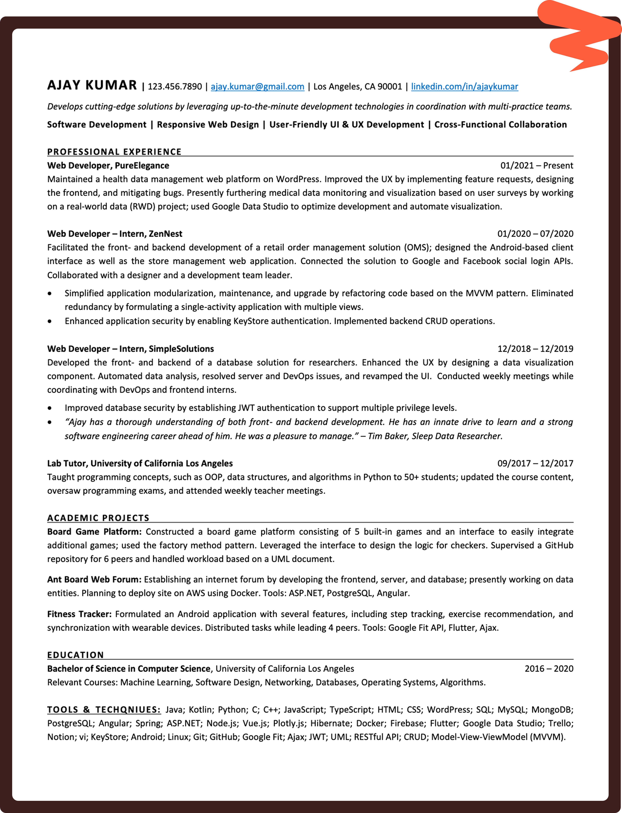

<!-- Banner -->

# New Grad Jobs 2026

 

<!-- Row 1: Job Stats (Custom Static Badges) -->

<!-- Row 2: Repository Stats -->

<!-- Row 3: Workflow Health -->

<!-- Row 4: Community & Links (for-the-badge style) -->

<!-- Zapply extension badge - add when extension launches -->
<!--  -->

🚀 Real-time software engineering, programming, and IT jobs from 5 companies like Tesla, NVIDIA, and Raytheon. Updated every 24 hours with 6 fresh opportunities for data analysts, scientists, and entry-level software developers.

🎯 Includes roles across tech giants, fast-growing startups, and engineering-first companies like Chewy, CACI, and TD Bank.

> [!TIP]
> 🛠  Help us grow! Add new jobs by submitting an issue! View [contributing steps](CONTRIBUTING.md) here.

---

## Join Our Community

Connect with fellow job seekers, get career advice, share experiences, and stay updated on the latest opportunities. Join our community of developers and CS students navigating their career journey together!

  
  &nbsp;&nbsp;&nbsp;&nbsp;
  

---

## Alerts

**Don't miss new opportunities!**  
- 🌟 **Star this repo** to get updates on your GitHub dashboard.
- 👁️ **Watch** for instant notifications on new jobs.
- 🔔 **Turn on notifications** to never miss FAANG+ postings.

---

## Live Stats

- 🔥 **Current Positions:** 6 hot data-focused jobs
- **🏢 Companies**: 5 companies
- 📅 **Last Updated:** January 21, 2026
- 🤖 **Next Update:** Tomorrow at 9 AM UTC

---

## SWE Internships 2026

### 🏢 **FAANG+ Internship Programs**

| Company | Program | Application Link |
|---------|---------|------------------|
| 🟢 **Google** | STEP Internship | 

 |
| 🟦 **Microsoft** | Explore Microsoft Program | 

 |
| 🔵 **Meta** | Software Engineer Intern | 

 |
| 📦 **Amazon** | SDE Internship | 

 |
| 🍎 **Apple** | Engineering & Technology Intern | 

 |
| 🎬 **Netflix** | Software Engineer Intern | 

 |
| ⚡ **Tesla** | Engineering Internship | 

 |
| 🎮 **Nvidia** | Ignite & SWE Internship | 

 |
| 💳 **Stripe** | Software Engineer Intern | 

 |
| ₿ **Coinbase** | Software Engineer Intern | 

 |

### 📚 **Top Software Internship Resources**

| Platform | Type | Description | Link |
|----------|------|-------------|------|
| **🚀 Wellfound (AngelList)** | Job Board | Startup jobs with salary & equity transparency |  |
| **🔗 LinkedIn Student Jobs** | Platform | Professional network for student opportunities |  |
| **🔵 Indeed Internships** | Job Board | Comprehensive internship search engine |  |
| **🏢 Glassdoor Internships** | Job Board | Internships with company reviews and salary data |  |
| **🎓 NACE Career Resources** | Resource | National Association of Colleges and Employers |  |

---

## Fresh Software Jobs 2026

### 🏢 **Other Companies** (6 positions)

| Company | Role | Location | Posted | Level | Apply |
|---------|------|----------|--------|-------|-------|
| 🏢 **Lone Wolf Technologies** | Account Executive | United State | 1d |  |  |
| 🏢 **Destination Knot** | Work From Home Hotel Reservations C... 🏠 | Atlanta | 2d |  |  |
| 🏢 **Bot Auto** | Machine Learning Engineer 3D Vision... | Houston, TX | 5d |  |  |
| 🏢 **Visual Concepts** | Character Artist Clothing NBA 2K | Novato, CA | 5d |  |  |
| 🏢 **Visual Concepts** | Character Artist Clothing NBA 2K | Novato, CA | 5d |  |  |
| 🏢 **Bloomerang** | Account Executive Level 2 | Remote 🏠 | 6d |  |  |

---

## Insights on the Repo

### 🏢 Top Companies (by current openings)

- **Visual Concepts**: 2 positions
- **Lone Wolf Technologies**: 1 position
- **Destination Knot**: 1 position
- **Bot Auto**: 1 position
- **Bloomerang**: 1 position

---

### 📈 Experience Breakdown

| Level               | Count | Percentage | Top Companies                     |
|---------------------|-------|------------|-----------------------------------|
| 🟢 Entry Level & New Grad | 2 | 33% | No or minimal experience |
| 🟡 Beginner & Early Career | 2 | 33% | 1-2 years of experience |
| 🔴 Manager | 2 | 34% | 2+ years of experience |

---

### 🌍 Top Locations
- **Novato, CA**: 2 positions
- **United States (Remote)**: 1 positions
- **Atlanta**: 1 positions
- **Houston, TX**: 1 positions
- **Remote 🏠**: 1 positions

---

### 🔮 Why Software Engineers Choose Our Job Board

✅ **100% Real Jobs**: 6 verified roles for Software Engineering roles from 5 companies.
 
✅ **Fresh Daily Updates**: Live data from Tesla, Raytheon, Chewy, and CACI refreshed every 24 hours automatically.
 
✅ **Entry-Level Focused**: Smart filtering for internships and entry-level analytics roles.
 
✅ **Intern-to-FTE Pipeline**: Track internships converting to full-time roles.
 
✅ **Direct Applications**: Bypass recruiters—apply directly to career pages for Tesla, Amazon, and NVIDIA.
 
✅ **Mobile-Optimized**: Ideal mobile experience for students job hunting between classes.

---

## Job Hunt Tips That Actually Work

### 🔍 **Research Before Applying**
- Find the hiring manager: Search "[Company] [Team] engineering manager" on LinkedIn.
- Check recent tech decisions: Review their engineering blog for stack changes or new initiatives.
- Verify visa requirements: Look for 🇺🇸 indicators or "US persons only" in the job description.
- [Use this 100% ATS-compliant and job-targeted resume template](https://docs.google.com/document/d/1EcP_vX-vTTblCe1hYSJn9apwrop0Df7h/export?format=docx).

### 📄 **Resume Best Practices**
- Mirror their tech stack:  Copy exact keywords from job post (React, Django, Node.js, etc.)..
- Lead with business impact: “Improved app speed by 30%” > “Used JavaScript.”
- Show product familiarity: Example: "Built Netflix-style recommendation engine" or "Created Stripe payment integration."
- [Read this informative guide on tweaking your resume](https://drive.google.com/uc?export=download&id=1H6ljywqVnxONdYUD304V1QRayYxr0D1e).

### 🎯 **Interview Best Practices**
- Ask domain questions: "How do you handle CI/CD at scale?" shows real research.
- Prepare case stories: "Migration failed, learned X, rebuilt with Y" demonstrates growth mindset.
- Reference their products:  "As a daily Slack user, I've noticed..." proves genuine interest.
- [Review this comprehensive interview guide on common behavioral, technical, and curveball questions](https://drive.google.com/uc?export=download&id=1MGRv7ANu9zEnnQJv4sstshsmc_Nj0Tl0).

  
  &nbsp;&nbsp;&nbsp;&nbsp;
  
  &nbsp;&nbsp;&nbsp;&nbsp;
  

---

## Become a Contributor

Add new jobs! See the [contributing guide](CONTRIBUTING.md).

### Contributing Guide
#### 🎯 Roles We Accept
- Located in the US, Canada, or Remote.
- Not already in our database.
- Currently accepting applications.

#### 🚀 How to Add Jobs
1. Create a new issue.
2. Select the "New Job" template.
3. Fill out and submit the form.
   > Submit separate issues for each position, even from the same company.

#### ✏️ How to Update Jobs
1. Copy the job URL to edit.
2. Create a new issue.
3. Select the "Edit Job" template.
4. Paste the URL and describe changes.

#### ⚡ What Happens Next
- Our team reviews within 24-48 hours.
- Approved jobs are added to the main list.
- The README updates automatically via script.
- Contributions go live at the next daily refresh (9 AM UTC).
- Questions? Create a miscellaneous issue, and we’ll assist! 🙏

## More Resources

  
  &nbsp;&nbsp;
  
  &nbsp;&nbsp;
  

  
  &nbsp;&nbsp;
  
  &nbsp;&nbsp;
  

  
  &nbsp;&nbsp;
  
  &nbsp;&nbsp;
  

---

**🎯 6 current opportunities from 5 companies**

**Found this helpful? Give it a ⭐ to support Zapply!**

*Not affiliated with any companies listed. All applications redirect to official career pages.*

---

**Last Updated**: January 21, 2026 • **Next Update**: Daily at 9 AM UTC

